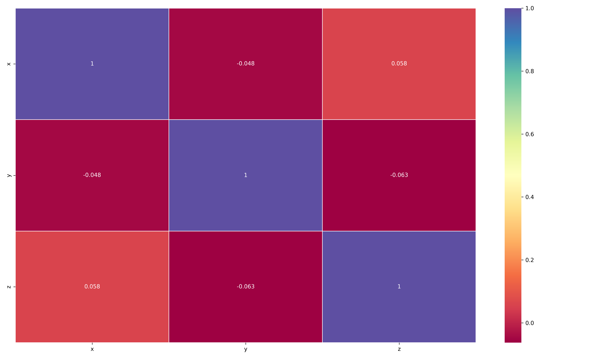

# AutoCorrMap. Automated correlation detection & visualization

---

## Description

AutoCorrMap is a lightweight Python tool that automatically scans your dataset for correlations between variables and displays the results in an intuitive heatmap.

Why AutoCorrMap?. Because exploring correlations should be fast, simple, and visual. Instead of spending time writing code to calculate and plot correlations, AutoCorrMap does the heavy lifting so you can focus on insights.

---

## Input files

A csv file with column names and numeric values (rows can be unnamed).

You can find a example file with the name example_data.csv

---

## Necessary librares and programs

- python
  - pandas
  - seaborn
  - matplotlib
 
---

## Example outputs

Example of the correlation map

---

## How to Run

From the terminal run this line as follow indicating the name of your csv file

python AutoCorrMap.py your_file.csv 

Author: José Emilio Ramírez Piña
