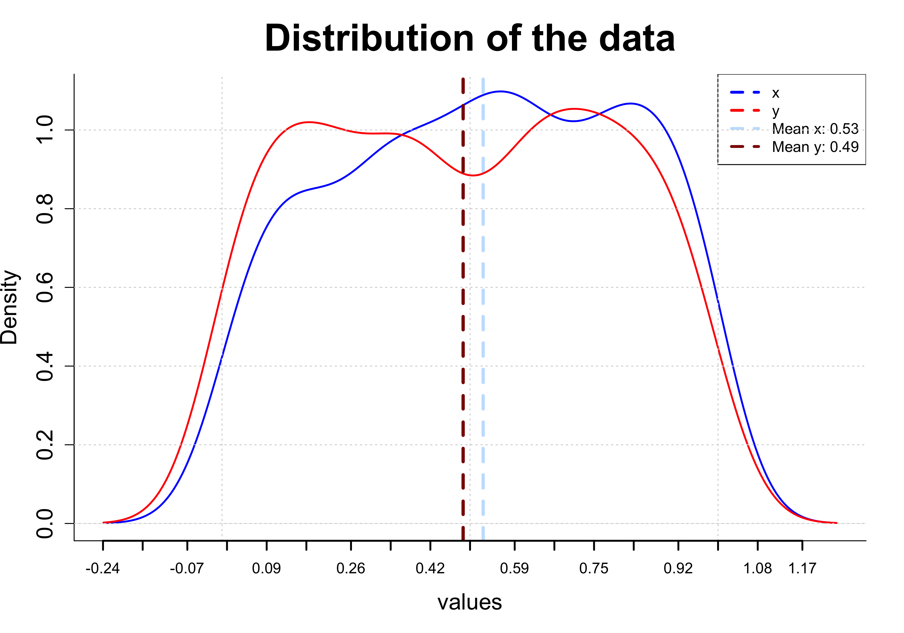

# ECDFplotter. Automatic plot of distributions, ECDFs and Kolmogorov-smirnov test

## Description

ECDFplotter is a lightweight tool that automatically generates visual comparisons between two datasets.
With a single command, it produces:

Distribution plots of the two datasets.
ECDF (Empirical Cumulative Distribution Function) plot for both datasets, including:
The p-value from the Kolmogorov–Smirnov test.
The D statistic of the test.

This tool is ideal for quick visual inspection of data similarity and for integrating statistical testing with intuitive plots.

## Input files

To run the script you only need a .csv file with two columns that contain the data to compare

You can find example files in the directory

## Necessary programs and libraries
- R (>= 4.0)

---

## Example outputs

Example output image of the distributions

Example output image of the ECDFs with D statistic and p-value of Kolmogorov-Smirnov

---

## How to Run

### **From the terminal**

Rscript ECDFplotter_script.R your_data.csv

your_data.csv → comma-delimited file with two columns and each column with his name.

### **From R**

You can also run the code in ECDFplotter_function.R directly within your R session.
Before using the function, load your data:

data <- read.csv("your_data.csv", header = T)

Then call the function:

ECDFplotter(data)

Author: José Emilio Ramírez Piña
