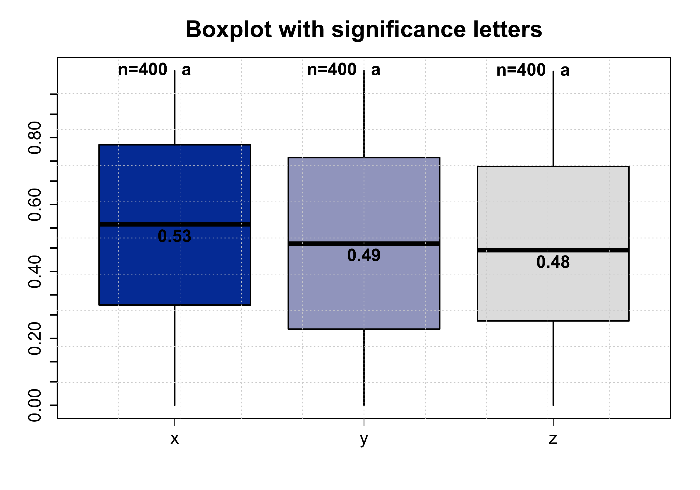

# StatBox – Automatic Boxplot Generation, ANOVA, and Tukey Test

## Description

StatBox is a lightweight R tool designed to automate the process of generating boxplots, running one-way ANOVA, and performing Tukey’s 
post-hoc test. With a single command, StatBox creates a boxplot from your dataset, calculates statistical significance, and provides a 
clear output of group comparisons — all using base R (no external plotting libraries). This tool is ideal for researchers, data 
analysts, and students who need a fast and reproducible way to analyze group differences without repetitive coding.

After run the code you obtain:

Boxplot of the data with group labels and distribution visualization.
ANOVA results showing whether significant differences exist between groups.
Tukey HSD table with adjusted p-values for pairwise comparisons.

## Input files

To run the script you only need a .csv file with any number of columns. The script group in automatic the data for the anova and
Tukey test.

You can find an example file in the directory for run the code

## Necessary programs and libraries
- R (>= 4.0)
  -multcompView  

---

## Example outputs

Example output image of the boxplot

Example output of Anova and tukey test

ANOVA Results:
             Df Sum Sq Mean Sq F value  Pr(>F)  
Group         2  16.80   8.402   5.621  0.0123 *
Residuals    12  17.92   1.493                  

Tukey Multiple Comparisons:
  diff   lwr    upr   p adj
B-A  2.15  0.32  3.98  0.018
C-A  3.42  1.59  5.25  0.001
C-B  1.27 -0.56  3.10  0.213

---

## How to Run

### **From the terminal**

Rscript StatBox_script.R your_data.csv

### **From R**

You can also run the code in StatBox_function.R directly within your R session.
Before using the function, load your data:

data <- read.csv("your_data.csv", header = T)

Then call the function:

StatBox(data)

Author: José Emilio Ramírez Piña
